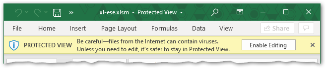

This spreadsheet is provided by Georgia EPD for use by labs to report drinking water sample microbial analysis results. For assistance, please contact the Watershed Protection Branch.

👉 [**Download** the latest version](https://github.com/gaepdit/xl-ese/raw/main/xl-ese.xlsm)

## Instructions

It is recommended that you save a new copy and rename the spreadsheet for each submission. If needed, a blank copy can be downloaded at the link above. After entering your data, use the "Export to XML" button to generate an XML file and upload it to the [eSample Entry website](https://ese.gadrinkingwater.net/ese/). It is recommended to name the XML file with the same name as the spreadsheet for future reference. Please note that the filename cannot contain spaces.

## Security warnings

Upon downloading and opening the spreadsheet, one or more security warnings will be displayed in Excel.

If the spreadsheet opens in "Protected View", you must click "Enable Editing" to use it.

If a security warning is shown stating that "Macros have been disabled," the embedded buttons on each sheet will not work until you click "Enable Content." This is required in order to export the XML file, but it is not required while entering lab data.

## Data entry

Some fields in the spreadsheet require that a selection be made from a drop-down list. The list can be accessed either by using the mouse or by hitting `Alt+DownArrow` on the keyboard.

Instructions for each column are provided below. Columns marked with a ★ are required. Columns marked with a ☆ are conditionally required (depending on other entries/values). Columns marked with a 🗏 require that the value be selected from a pre-defined list.

- ★ **Lab Certification #** *(required)* - Enter the lab certification ID assigned to your lab by the state.

### Samples data entry

Information on each sample analyzed should be entered in the Samples worksheet.

- ★ **Lab Sample ID** *(required)* - Each sample must have a unique identifier assigned or used by the laboratory that cannot be repeated. Must not be longer than 20 characters.

- ★ **PWS Number** *(required)* - The state-assigned Public Water System identifier. Must be exactly 9 characters.

- ★ **Sample Collection Date** *(required)* - The date the sample was collected. Must be no later than the current date.

- **Sample Collection Time** - The time the sample was collected at the sample site. Be exact.

    Must be entered as a time. For example, you can type "1 pm" or "1:00 pm" or "13:00".

- ★ **Sampling Point ID** *(required)* - Identifier for the sample station/location within the Water System Facility from which the sample is drawn. Must not be longer than 12 characters.

- ★ **Sample Type** *(required)* - Indicate the purpose for taking the sample.

    🗏 Acceptable values are:

    - Routine
    - Repeat
    - Special
    - Batch Blank
    - Field Blank
    - Performance Evaluation
    - Shipping Blank
    - Split Blank
    - Maximum Residence Time
    - Matrix Spike
    - Triggered

- ☆ **Repeat Location** *(conditionally required)* - Location of repeat sample relative to original. This column is required if the Sample Type above is "Repeat"; otherwise, it is not used.

    🗏 Acceptable values are:

    - Downstream within 5 connections of original
    - Near first service connection
    - Original site
    - Other
    - Upstream within 5 connections of original

- ☆ **Original Lab Sample ID** *(conditionally required)* - The identifier for the original sample that this sample replaces. This column is required if the Sample Type above is "Repeat"; otherwise, it is not used. Must not be longer than 20 characters.

- ☆ **Original Sample Collection Date** *(conditionally required)* - The date when the original sample was collected. This column is required if the Sample Type above is "Repeat"; otherwise, it is not used. Must be no later than the current date.

- **Lab Receipt Date** - The date when the sample was received at the laboratory (may be different for each sample). Must be no earlier than the Sample Collection Date and no later than the current date.

- **Sample Collector Full Name** The name of the person who collected the sample in the form "Last name, First name". Must not be longer than 40 characters.

- **Free Chlorine Residual** - Amount of free chlorine measured in mg/L taken at the sample site. Must be a number between 0.01 and 99.0.

### Results data entry

Enter the analysis results for total coliform first. *E. coli* results are only required if total coliform positive is selected. The columns for total coliform and *E. coli* are identical.

- ★ **Presence** *(required)* - Indicate whether the presence of microbes was detected.

    🗏 Acceptable values are "Present" or "Absent".

- **Analytical Method** - The approved method used to analyze the sample.

- **Analysis Start Date** - The date when the analysis began. *This is the analysis start date (incubation start date).* Must not be prior to the Sample Collection Date.

- **Start Time** - The local time when the analysis began. *This is the analysis start time (incubation start time).*

    Must be entered as a time. For example, you can type "1 pm" or "1:00 pm" or "13:00".

- **End Date** - The date when the analysis was finished. Must not be prior to the Sample Collection Date or Analysis Start Date.

- **End Time** - The local time when the analysis was finished.

    Must be entered as a time. For example, you can type "1 pm" or "1:00 pm" or "13:00".
