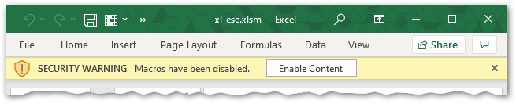

# eSample Data Entry Spreadsheet

This spreadsheet is provided by Georgia EPD for use by labs to report drinking water sample microbial analysis results. 

The latest version can be downloaded from the [releases page](https://github.com/gaepdit/xl-ese/releases).

For assistance contact Sean Earley, Watershed Protection Branch. For technical support or to report errors with the spreadsheet, submit a request at the [GA EPD-IT support page](https://gaepd.zendesk.com/hc/en-us/requests/new).

## Instructions

It is recommended that you save a new copy and rename the spreadsheet for each submission. If needed, a blank copy can be downloaded at the link above. After entering your data, do not send the spreadsheet to EPD. Instead use the "Export to XML" button to generate an XML file and send that to EPD. It is recommended to name the XML file with the same name as the spreadsheet for future reference.

## Security warnings

Upon downloading and opening the spreadsheet, one or more security warnings will be displayed in Excel.

If the spreadsheet opens in "Protected View", you must click "Enable Editing" to use it.

If a security warning is shown stating that "Macros have been disabled," the embedded buttons on each sheet will not work until you click "Enable Content." This is required in order to export the XML file, but it is not required while entering lab data.

## Data entry

Some fields in the spreadsheet require that a selection be made from a drop-down list. The list can be accessed either by using the mouse or by hitting `Alt-DownArrow` on the keyboard.

Instructions for each column are provided below. Columns marked with a ★ are required. Columns marked with a ☆ are condtionally required (depending on other entries/values).

### Samples data entry

Information on each sample analyzed should be entered in the Samples worksheet.

- ★ **Lab Sample ID** Each sample must have a unique identifier that cannot be repeated. 
- **State Sample Number** Add instructions here…
- ☆ **Original Lab Sample ID** Add instructions here…

### Results data entry

Information on each sample analysis result should be entered in the Results page.

- ★ **Lab Sample ID** Add instructions here…
- ★ **Sample Collection Date** Add instructions here…
